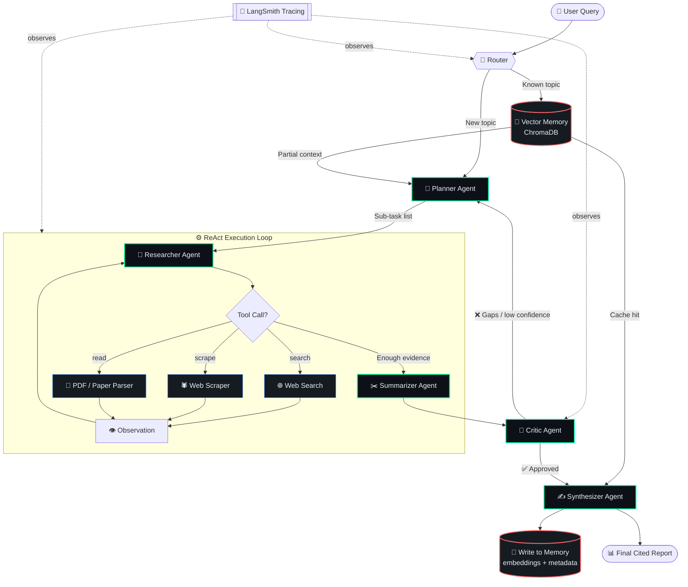
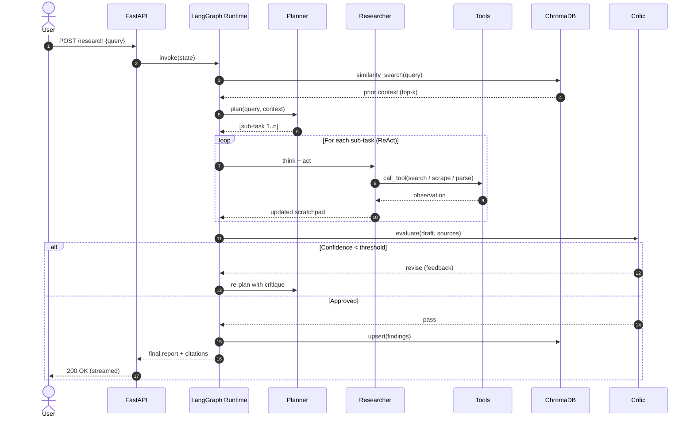

<div align="center">


### 🧠 An autonomous multi-agent research system that plans, browses, reads, critiques, and remembers, so you get cited answers instead of guesses.

<br/>


<br/>

[**Architecture**](#-agentic-architecture--workflow) •
[**Agents**](#-key-agent-capabilities) •
[**Quickstart**](#-getting-started) •
[**Usage**](#-usage--execution-example) •
[**Roadmap**](#-future-roadmap)

</div>

---

## 📖 Overview & Problem Statement

Standard zero-shot LLM prompting fails on real research tasks:

| ❌ Zero-Shot LLM | ✅ NEXUS Agentic Workflow |
|---|---|
| Hallucinates facts and citations | Grounds every claim in retrieved sources |
| Knowledge frozen at training cutoff | Live web search and scraping tools |
| Single-pass, no self-correction | Reflection loop: critique, then revise |
| Stateless, forgets everything | Persistent vector memory across sessions |
| Opaque reasoning | Full trace of every thought, tool call, and state transition |

**NEXUS** decomposes a research question into a plan, dispatches specialized agents to execute it, verifies the output with a critic, and writes durable findings to long-term memory. It follows a **Plan-and-Execute + ReAct + Reflection** pattern built on a LangGraph state machine.

---

## 🏗️ Agentic Architecture & Workflow

### State Graph & Reasoning Loop



### Sequence View: One Full Cycle



---

## 🤖 Key Agent Capabilities

### Agent Roster

| Agent / Node | Role | Tools & Access | Output |
|---|---|---|---|
| 🧭 **Router** | Classifies intent and checks memory before spending tokens | `memory.search` | Route decision |
| 📝 **Planner** | Decomposes the query into ordered, verifiable sub-tasks | LLM reasoning, memory context | `Plan[]` |
| 🔬 **Researcher** | ReAct loop: think, act, observe until evidence is sufficient | `web_search`, `web_scraper`, `pdf_parser`, `arxiv_api` | Raw evidence + sources |
| ✂️ **Summarizer** | Compresses documents into claim-level notes with provenance | Chunker, map-reduce chain | Structured notes |
| 🧐 **Critic** | Scores faithfulness and coverage, then triggers re-plan if low | Rubric prompt, LLM-as-judge | `score`, `feedback` |
| ✍️ **Synthesizer** | Writes the final report with inline citations | Template engine, citation formatter | Markdown report |
| 💾 **Memory Manager** | Embeds and upserts verified findings | `text-embedding-3-small`, ChromaDB | Persisted vectors |

### 🔭 Observability & Guardrails

- **LangSmith tracing**: every node, tool call, token count, and latency is captured per run.
- **Structured state**: typed `AgentState` (Pydantic) makes each transition inspectable and replayable.
- **Loop guards**: `MAX_ITERATIONS`, token budgets, and tool timeouts prevent runaway agents.
- **Critic gate**: no answer is returned without passing a faithfulness threshold.
- **Retries with backoff** on tool and LLM failures, with fallback to a secondary model.

---

## 📂 Directory Structure

```text
nexus/
├── 📁 src/
│   └── nexus/
│       ├── 📁 agents/
│       │   ├── router.py
│       │   ├── planner.py
│       │   ├── researcher.py
│       │   ├── summarizer.py
│       │   ├── critic.py
│       │   └── synthesizer.py
│       ├── 📁 graph/
│       │   ├── state.py            # Typed AgentState (Pydantic)
│       │   ├── nodes.py            # Node wrappers
│       │   ├── edges.py            # Conditional routing logic
│       │   └── builder.py          # StateGraph compilation
│       ├── 📁 tools/
│       │   ├── web_search.py
│       │   ├── web_scraper.py
│       │   ├── pdf_parser.py
│       │   └── registry.py
│       ├── 📁 memory/
│       │   ├── vector_store.py     # ChromaDB client
│       │   ├── embeddings.py
│       │   └── retriever.py
│       ├── 📁 prompts/
│       │   └── *.yaml              # Versioned system prompts
│       ├── 📁 observability/
│       │   └── tracing.py          # LangSmith setup
│       ├── 📁 api/
│       │   ├── main.py             # FastAPI app
│       │   └── schemas.py
│       └── config.py               # Settings via pydantic-settings
├── 📁 ui/
│   └── app.py                      # Streamlit frontend
├── 📁 evals/
│   ├── datasets/
│   └── run_evals.py
├── 📁 tests/
│   ├── unit/
│   └── integration/
├── 📁 data/
│   └── chroma/                     # Persistent vector store (gitignored)
├── .env.example
├── .gitignore
├── Dockerfile
├── docker-compose.yml
├── requirements.txt
├── pyproject.toml
└── README.md
```

---

## 🚀 Getting Started

### Prerequisites

- Python **3.11+**
- Docker & Docker Compose (optional, recommended)
- API keys: OpenAI, Tavily (search), LangSmith (optional but recommended)

### 1️⃣ Clone the repository

```bash
git clone https://github.com/your-username/nexus.git
cd nexus
```

### 2️⃣ Create a virtual environment & install dependencies

```bash
python -m venv .venv
source .venv/bin/activate        # Windows: .venv\Scripts\activate
pip install --upgrade pip
pip install -r requirements.txt
```

### 3️⃣ Configure environment variables

```bash
cp .env.example .env
```

```ini
# .env
OPENAI_API_KEY=sk-...
TAVILY_API_KEY=tvly-...

# Observability (LangSmith)
LANGCHAIN_TRACING_V2=true
LANGCHAIN_API_KEY=lsv2_...
LANGCHAIN_PROJECT=nexus-agent

# Agent behavior
LLM_MODEL=gpt-4o
EMBEDDING_MODEL=text-embedding-3-small
MAX_ITERATIONS=6
CRITIC_THRESHOLD=0.8
CHROMA_PERSIST_DIR=./data/chroma
```

### 4️⃣ Run locally

```bash
# Terminal 1: API
uvicorn nexus.api.main:app --reload --port 8000

# Terminal 2: UI
streamlit run ui/app.py
```

### 🐳 Or run with Docker

```bash
docker compose up --build
```

| Service | URL |
|---|---|
| FastAPI (docs) | http://localhost:8000/docs |
| Streamlit UI | http://localhost:8501 |

---

## 💻 Usage / Execution Example

### Python SDK

```python
from nexus.graph.builder import build_graph

graph = build_graph()

result = graph.invoke(
    {"query": "What are the latest advances in speculative decoding for LLM inference?"},
    config={"configurable": {"thread_id": "session-001"}},
)

print(result["final_report"])
```

### REST API

```bash
curl -X POST http://localhost:8000/research \
  -H "Content-Type: application/json" \
  -d '{"query": "Latest advances in speculative decoding", "stream": true}'
```

### 🧾 Sample Execution Trace

```text
$ nexus run "Latest advances in speculative decoding"

[00:00.12] 🧭 ROUTER        → memory.search(k=5) ... 1 partial hit (score 0.71)
[00:00.45] 📝 PLANNER       → Generated 4 sub-tasks
                              ├─ 1. Survey core speculative decoding methods
                              ├─ 2. Find 2024-2026 papers (Medusa, EAGLE, etc.)
                              ├─ 3. Compare speedup / acceptance-rate benchmarks
                              └─ 4. Identify production-serving trade-offs
[00:01.02] 🔬 RESEARCHER    → Thought: Need recent benchmarks, starting with arXiv.
[00:01.03] 🛠️  TOOL          → web_search("speculative decoding benchmarks")  → 8 results
[00:02.87] 🛠️  TOOL          → pdf_parser(arxiv.org/abs/...)                  → 14 chunks
[00:04.10] 🔬 RESEARCHER    → Observation: Strong evidence for sub-tasks 1-3. Need serving data.
[00:04.11] 🛠️  TOOL          → web_scraper(inference-engine blog)             → 1 page
[00:06.30] ✂️  SUMMARIZER   → 23 claim-level notes with provenance
[00:07.85] 🧐 CRITIC        → faithfulness=0.91  coverage=0.78  → ⚠️ REVISE (gap: task 4)
[00:07.86] 📝 PLANNER       → Re-plan: +1 sub-task (serving trade-offs)
[00:11.40] 🧐 CRITIC        → faithfulness=0.93  coverage=0.89  → ✅ APPROVED
[00:13.20] ✍️  SYNTHESIZER  → Report generated (1,240 words, 11 citations)
[00:13.55] 💾 MEMORY        → Upserted 23 vectors → collection: research_notes

✔ Done in 13.6s | 4,812 tokens | 2 iterations | trace: https://smith.langchain.com/r/...
```

---

## 🗺️ Future Roadmap

- [ ] 🙋 **Human-in-the-Loop**: LangGraph interrupts so users can approve plans, edit sub-tasks, or veto tool calls before execution.
- [ ] 📏 **Automated Evaluation**: Regression suite using RAGAS and LLM-as-judge metrics (faithfulness, answer relevance, citation precision) wired into CI.
- [ ] 🧠 **Tiered Memory**: Add episodic and semantic memory layers with decay and summarization, plus a knowledge graph for entity relationships.
- [ ] 🌐 **Scalable Multi-Agent Runtime**: Parallel researcher fan-out, async task queue (Celery/Redis), and Kubernetes deployment with autoscaling.
- [ ] 🔒 **Safety & Governance**: Prompt-injection defenses for scraped content, PII redaction, and per-tool permission scopes.

---

## 🤝 Contributing

Contributions are welcome! Please open an issue to discuss major changes, then submit a PR with tests.

```bash
pre-commit install
pytest tests/ -v
```

## 📄 License

Distributed under the **MIT License**. See [`LICENSE`](LICENSE) for details.

<div align="center">

**Built with 🧠 by [Your Name](https://github.com/your-username)** · ⭐ Star this repo if NEXUS helped you!

</div>
