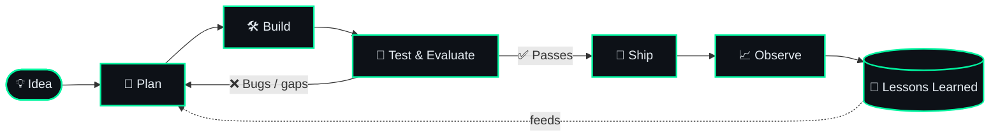

<div align="center">


<br/>


</div>

---

## 🧠 `whoami`

```bash
$ whoami
> sajag // AI engineer & builder

$ cat mission.txt
> Build agents that think, use tools, remember, and get real work done.

$ cat currently.txt
> 🔭 Building multi-agent systems with LangGraph
> 🌱 Learning: agent evaluation, memory architectures, MCP
> 💬 Ask me about: LLM agents, RAG, automation, Python
> ⚡ Fun fact: I let agents write half my boilerplate

$ status
> ONLINE | open to collaborate 🤝
```

---

## ⚙️ How I Work (My Own Agent Loop)



---

## 🧰 Tech Stack

**🤖 Agents & LLMs**


**🧠 Memory & Data**


**🏗️ Backend & Deployment**


---

## 🚀 Featured Projects

| 🤖 Agent | 📝 What it does | 🧰 Stack |
|---|---|---|
| **[Agentic_Chatbot_With_HITL](https://agentic-chatbot-with-hitl-10.onrender.com/)** | Autonomous research agent that searches, reads, critiques, and remembers | `LangGraph` `Groq` `Tavilly Serch` |
| **[Realestatepricepredictormlproject](https://real-estate-price-predictor-fgsf7jiewl2fkae95wvbk8.streamlit.app/)** | One-line description of your second project | `Scikit-learn` `Streamlit` |


> 💡 Replace the rows above with your real repos. Pin your best 4 to 6 repos on your profile as well.

---

## 📊 GitHub Telemetry

<div align="center">


<br/>


<br/>


</div>

---

## 🏆 Trophies

<div align="center">


</div>

---

## 🗺️ Roadmap (Loading...)

```text
[██████████░░░░░░░░░░] 50%  Multi-agent orchestration
[███████░░░░░░░░░░░░░] 35%  Agent evaluation & observability
[█████░░░░░░░░░░░░░░░] 25%  MCP servers & tool ecosystems
[███░░░░░░░░░░░░░░░░░] 15%  Human-in-the-loop systems
```

---

## 📫 Let's Connect

<div align="center">

[](https://github.com/buildwithsajag)
[](https://linkedin.com/in/your-handle)
[](https://x.com/your-handle)
[](mailto:your-email@example.com)

<br/>

```text
> agent.status = "ready"
> agent.next_task = "build something awesome together"
```


</div>
